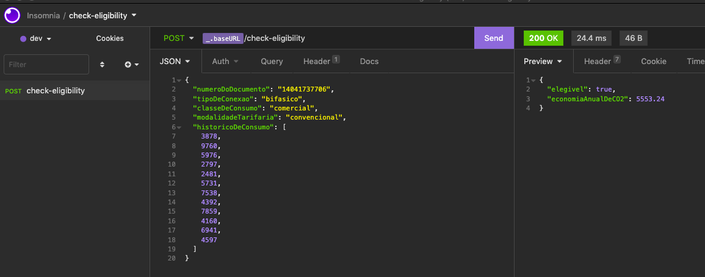
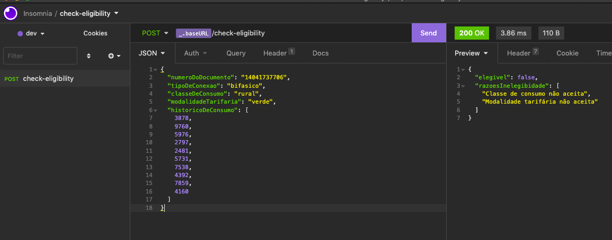

# Eligibility Check API

Uma API para verificar a eligibilidade de um possível cliente.

## Pré-requisitos:

- [NodeJS](https://nodejs.org/en/)

## Instalação:
```
npm install
```
## Rodando o projeto:

Para rodar em uma porta específica, crie um arquivo **.env** na raíz do projeto e coloque a porta de interesse:

```
// .env file
PORT=8080
```

Por padrão, quando rodado localmente, será usada a porta 4242

```
npm start
```

- Para rodar usando as dependências de desenvolvimento:
```
npm run dev
```

Será possível interagir com aplicação por algum rest client (insomnia, postman etc) ou por meio da documentação openapi (http://localhost:{PORT}/api-docs/).

## Critérios de Elegibilidade:
Para checar a elegibilidade, foram aplicados os seguintes critérios:

- Classe de consumo da cliente
    - Possíveis Valores: Comercial, Residencial, Industrial, Poder Público, e Rural.
    - Elegíveis: Comercial, Residencial e Industrial.
- Modalidade tarifária
    - Possíveis Valores: Branca, Azul, Verde, e Convencional.
    - Elegíveis: Convencional, Branca.
- Consumo mínimo do cliente
    - O cálculo deve ser feito utilizando a média dos 12 valores mais recentes do histórico de consumo.
        - Clientes com tipo de conexão Monofásica só são elegíveis caso tenham consumo médio acima de 400 kWh.
        - Clientes com tipo de conexão Bifásica só são elegíveis caso tenham consumo médio acima de 500 kWh.
        - Clientes com tipo de conexão Trifásica só são elegíveis caso tenham consumo médio acima de 750 kWh.
- Para calcular a projeção da **economia anual** de CO2, considere que para serem gerados 1000 kWh no Brasil são emitidos em média 84kg de CO2.

## Exemplos de Requisições e respostas:

- Consumidor elegível: 


- Consumidor não elegível:


## Discussões gerais

Foi uma decisão, para este contexto, não fazer nenhuma persistência de dados. Inclusive, talvez fosse um bom cenário para fazer o uso do serviço AWS Lambda.